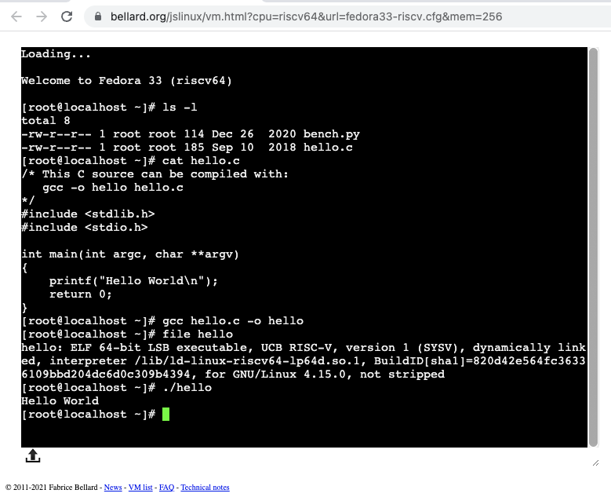

# JSLinux

JSLinux is a RISC-V emulator written by Fabrice Bellard. It enables you to
run Linux in your web browser.

Each program takes a few seconds to load the first time, depending on
your internet speed. But once loaded they are quite usable on a modern
computer.  On my M1 Mac Mini in Chrome it runs my [Primes
benchmark](primes) in 190 seconds, comparable to
a 200 MHz single-issue RISC-V CPU.

There are versions with Fedora 33 or Buildroot, console or X Windows.

Both Fedora and Buildroot have the GNU toolchain installed so you can
write and build C or assembly language programs and run them. There is
objdump to disasemble the binary code. Both include sample C and
Python programs.

Fedora of course has a lot more software included, including emacs,
vi/vim, nano, wget and curl, git, ssh&scp. So you can grab things from
the internet and try them.

[RISC-V Fedora Linux console version](https://bellard.org/jslinux/vm.html?cpu=riscv64&url=fedora33-riscv.cfg&mem=256)

See the [main JSLinux page](https://bellard.org/jslinux) for other versions.

You can also download the underlying
[TinyEMU](https://bellard.org/tinyemu/) and Linux disk images and run
them on your own computer.
