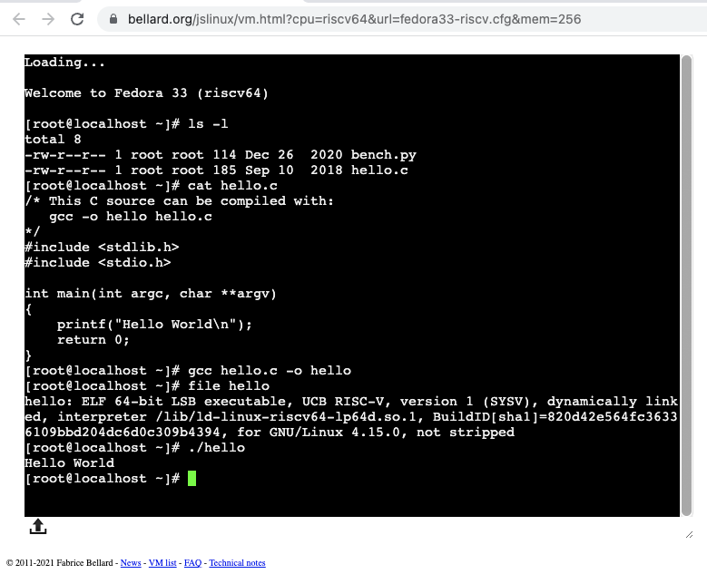

## TinyEMU

TinyEMU is an emulator written by Fabrice Bellard. You can download it
to your computer or run it in your web browser using JavaScript.

[Main page](https://bellard.org/tinyemu/)

[RISC-V Fedora Linux 33 Console](https://bellard.org/jslinux/vm.html?cpu=riscv64&url=fedora33-riscv.cfg&mem=256)

The Fedora image has a sample Python benchmark and a C helloWorld.

