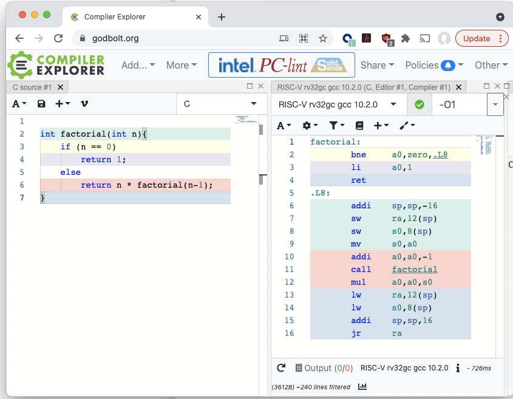

# Compiler Explorer

If you want to quickly see what assembly language code is generated
from C code for RISC-V (or a number of other ISAs) the site
http://godbolt.org is very useful.

You can choose rv32 or rv64, different versions of gcc or clang, and
different compiler options such as optimisation levels or code
generation options such as whether to use extensions such as M, F, D,
or C.

Here is a sample showing a [simple factorial function](https://godbolt.org/z/7dM4WqhMb)

